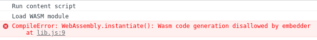

# Can we build browser extensions with WASM?

[WASM](https://webassembly.org/) is [supported by all mayor browsers](https://caniuse.com/wasm).
Also building [Browser Extensions](https://browserext.github.io/charter/) with WASM modules
should (theoretically) work.
Unfortunately, this does not seem to be the case.

Using this extension with Chrome/Chromium (`v93.x`)
while opening a website like https://news.ycombinator.com/
leads to this error

although `'wasm-eval'` is set in `content_security_policy` (within `manifest.json`).

**Is there a solution or do we have to say goodbye to the idea of using WASM in browser extensions?**

---

There is a workaround for (current) stable Chrome: It's possible to instantiate Wasm module even without CSP settings inside a Web Worker. However this bug (?) seems to be fixed in the Chrome Canary, even though it's marked as `wontFix` (https://bugs.chromium.org/p/chromium/issues/detail?id=1239976). See https://bugs.chromium.org/p/chromium/issues/detail?id=1173354#c21 for more info about the workaround. It works for both manifest V2 and V3.

I've encountered another Chrome bug/missing feature while I was implementing the workaround: Web Worker cannot be created from a content script (https://bugs.chromium.org/p/chromium/issues/detail?id=357664). So there is the workaround for the workaround - "Web Worker proxy": https://github.com/Rob--W/chrome-api/tree/master/worker_proxy. (The script has been written for the manifest version 2, it fails on `undefined window` when you try to run it with the version 3.)

Fortunately the discussions about manifest v3 features seem to be quite active (e.g. https://bugs.chromium.org/p/chromium/issues/detail?id=1173354#c23) and companies like 1Password push for Wasm compatibility because their business depends it. So I think there is a chance the workaround mentioned above will be enough until the manifest V3 is extended to support Wasm or the current implementation is fixed.

(I was testing it on Windows Chrome 94.0.4606.81.)

